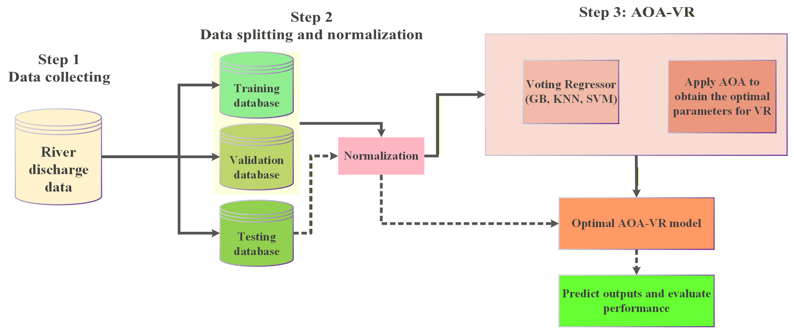
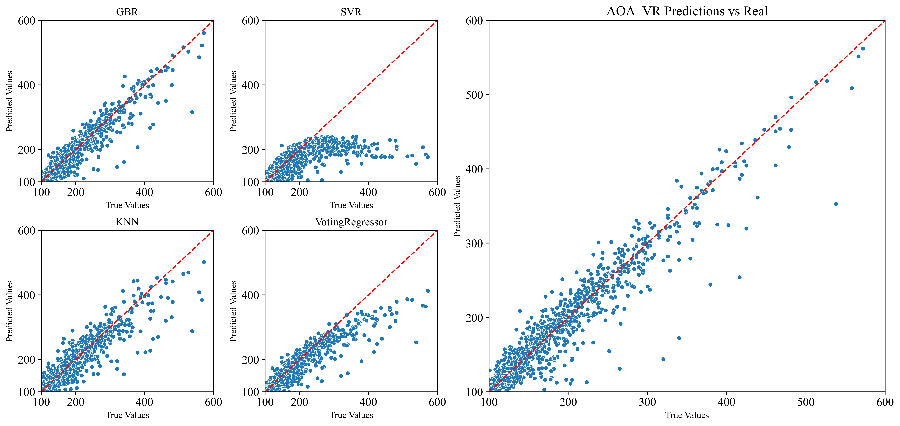
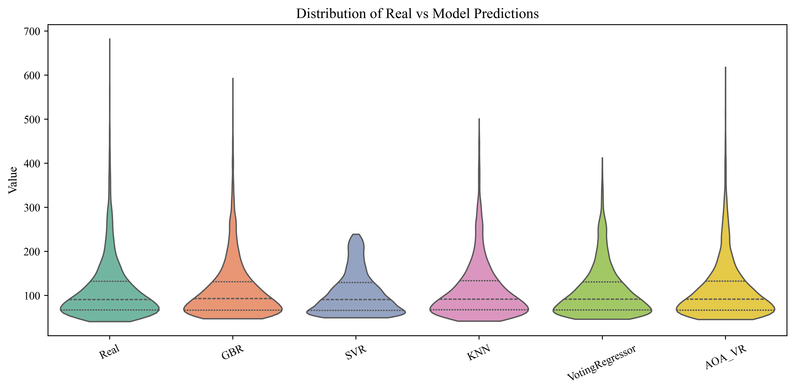
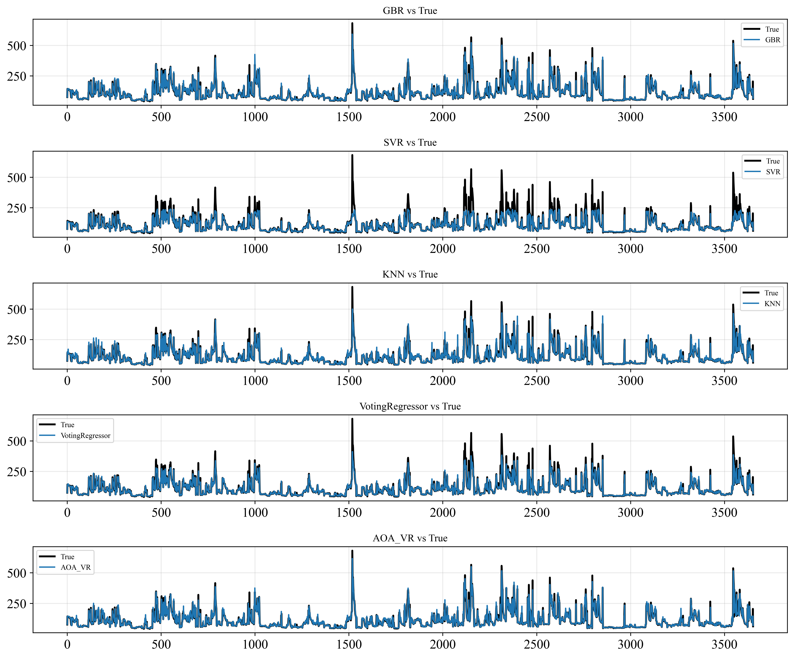

# 💧 River Discharge Forecasting using Machine Learning and AOA Optimization

> **An intelligent framework for river discharge forecasting using ensemble regression models optimized by the Arithmetic Optimization Algorithm (AOA).**  
> The dataset is prepared with **lag features** to forecast **next-day discharge**, but the framework can be easily adapted to other time series forecasting tasks.

---

## 🧠 Overview

This project integrates **machine learning regression models** (GBR, SVR, KNN, Voting Regressor)  
with the **Arithmetic Optimization Algorithm (AOA)** to optimize model parameters and ensemble weights.  
It is designed to predict **tomorrow’s river discharge** based on historical flow data, but users can replace the dataset to apply it to any regression or forecasting problem.

The framework automatically:
1. Loads and preprocesses data  
2. Splits into training, validation, and test sets  
3. Trains multiple regression models  
4. Optimizes ensemble weights and hyperparameters using **AOA**  
5. Evaluates models using multiple metrics (R², RMSE, MAE, MSE)  
6. Produces visual outputs and exports all results

---

## 📊 Example Dataset

The provided example uses **river discharge data**, but users can replace it with any numerical dataset.  
To use your own data:
1. Place your file in the `./data/` directory.
2. Update the filename and sheet names in `config/setting.yaml`.
3. Run the main script again.

---

## ⚙️ Configuration (config/setting.yaml)

All parameters can be controlled from the configuration file.

```yaml
data:
  name: "station1"
  path: "./data/station1.xlsx"
  sheet_range: [1, 5]

train:
  split:
    train_end: 2577
    valid_end: 3105
  batch_size: 32
  epochs: 50

optimization:
  method: "AOA"
  population_size: 100
  epochs: 100
  alpha: 5
  miu: 0.5
  moa_min: 0.2
  moa_max: 0.9

results:
  metrics_dir: "./results/metrics/"
  predictions_dir: "./results/predictions/"
  plots_dir: "./results/prediction_plots/"
```

---

## 🧩 Workflow

<p align="center">
  
</p>

**Workflow Summary:**

1. **Data Loading & Normalization** using MinMaxScaler
2. **Base Regressors:** Gradient Boosting, SVR, KNN
3. **Ensemble:** Voting Regressor
4. **Optimization:** AOA for weight and hyperparameter tuning
5. **Evaluation:** Compute R², RMSE, MAE, MSE
6. **Visualization:** Scatter plots, violin plots, and time-series comparisons

---

## 📈 Visual Outputs

| Type | Description | Example |
|------|-------------|---------|
| **Scatter Plots** | Predicted vs True values for all models |  |
| **Violin Plot** | Distribution of model predictions |  |
| **Time Series** | Comparison of predicted and true values over time |  |

---

## 🧾 Results

All results (metrics, predictions, and visualizations) are automatically saved to:

```
results/
│
├── metrics/             # R², RMSE, MAE, MSE summary
├── predictions/         # Excel files with model outputs
└── prediction_plots/    # All generated plots
```

Each file is named according to the dataset and scenario defined in the configuration file.

---

## 📦 Installation

```bash
git clone https://github.com/rasoulameri/River_Discharge_Regression.git
cd River_Discharge_Regression
pip install -r requirements.txt
```

---

## ▶️ Usage

To run the framework:

```bash
python main.py
```

or for Jupyter visualization:

```bash
jupyter notebook notebooks/EDA_and_Visualization.ipynb
```

---

## 🧠 Example Models

| Model | Description |
|-------|-------------|
| **GBR** | Gradient Boosting Regressor |
| **SVR** | Support Vector Regressor |
| **KNN** | k-Nearest Neighbors Regressor |
| **VR** | Ensemble Voting Regressor |
| **AOA_VR** | AOA-tuned ensemble with optimal hyperparameters |


---

## 📄 Data Availability Statement

The raw data used in this project (river discharge samples) are provided for demonstration. Users are encouraged to replace them with their own datasets.

---

## 🏗 Repository Structure

```
River_Discharge_Regression/
│
├── config/
│   └── setting.yaml                # Main configuration
│
├── data/
│   └── River_Discharge.xlsx        # Example dataset
│
├── src/
│   ├── models.py
│   ├── data_loader.py
│   ├── evaluate.py
│   ├── optimization.py
│   └── train.py
│
├── results/
│   ├── metrics/
│   ├── predictions/
│   └── prediction_plots/
│
├── requirements.txt
│
└─ main.py
```

---

## 📫 Contact

**Rasoul Ameri**  
📧 [rasoulameri@gmail.com](mailto:rasoulameri90@gmail.com)  
🔗 [GitHub Profile](https://github.com/rasoulameri)

---